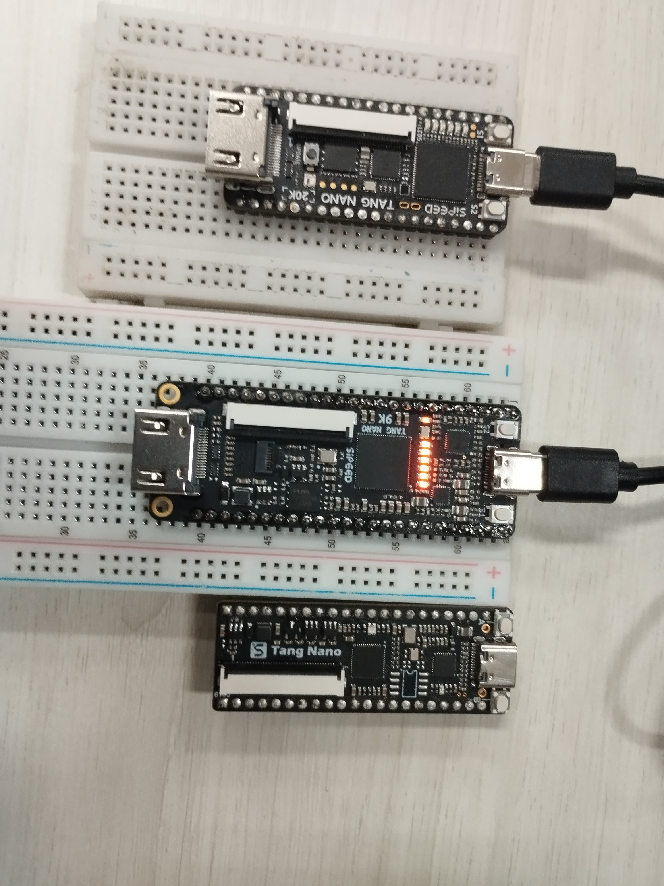

# RISC-V ISA CI

CI/CD for RISC-V cores

If you don't speak Portuguese, [click here](README_en.md)

Si no hablas portugués, [haz clic aquí](README_es.md)

Software developed to test processors based on the RISC-V architecture. The software covers tests from the synthesis of the processor in HDL language (Verilog or VHDL) to the execution of instructions with the processor operating on an FPGA.

## Requirements:

To run the software, the installation of some dependencies is required. Among them are:

- Litex: [https://github.com/enjoy-digital/litex](https://github.com/enjoy-digital/litex)
- Requests: [https://pypi.org/project/requests/](https://pypi.org/project/requests/)
- GitPython: [https://pypi.org/project/GitPython/0.3.2/](https://pypi.org/project/GitPython/0.3.2/)
- OSS-Cad-Suite: [https://github.com/YosysHQ/oss-cad-suite-build](https://github.com/YosysHQ/oss-cad-suite-build)
- Toolchain for the board to be used: Gowin, Vivado, Quartus ...

## Hardware:

To run the processors, at least one FPGA is required. Currently, the following FPGAs are supported:

- Tang nano 20k
- Tang nano 9k
- Lattice ECP5 45F

## Implemented Parts

- [x] Clone and Pull GIT repositories
- [x] Synthesis of Core(s)/SoC(s)
- [ ] Standardization of pinouts for various FPGAs
- [ ] Verification of the synthesis process
- [x] Writing to FPGA
- [ ] Serial debugger with FPGA
- [ ] Execution of instructions
- [ ] Automated sending of memory files to FPGA

## Questions and Bugs:

In case of any questions, application bugs, or suggestions, use the [issues](https://github.com/JN513/riscv-isa-ci/issues) menu on Github.

## License:

This repository is licensed under the GNU General Public License V3. Third-party libraries and software follow the licenses used by the original repositories.

## Third-party Software:

- UART Module Implementation: [https://github.com/ben-marshall/uart](https://github.com/ben-marshall/uart)
